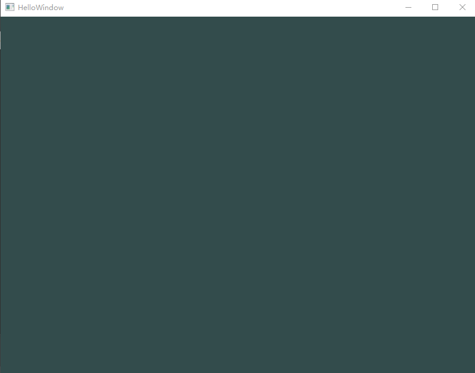
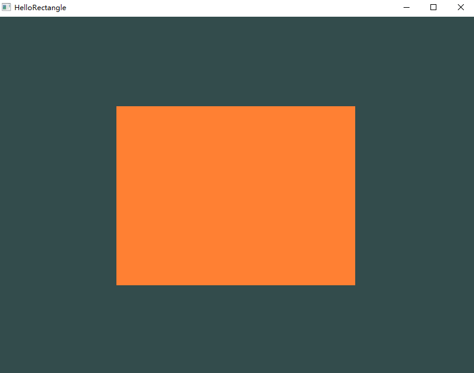
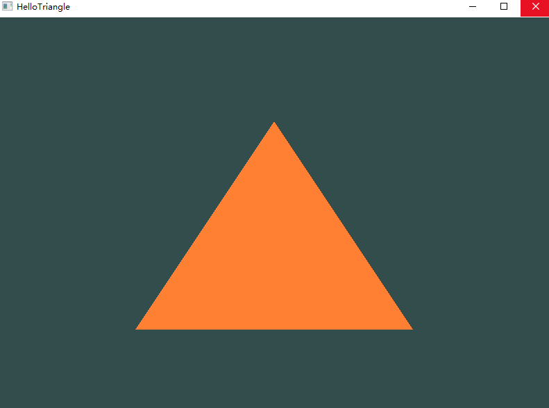
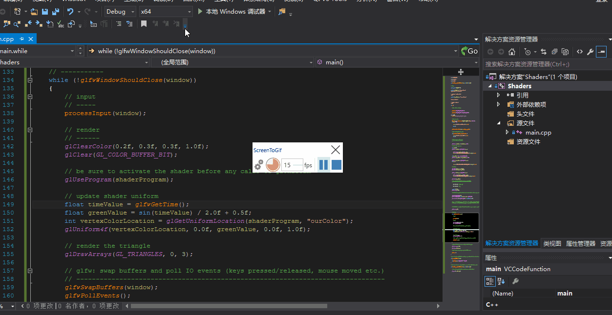
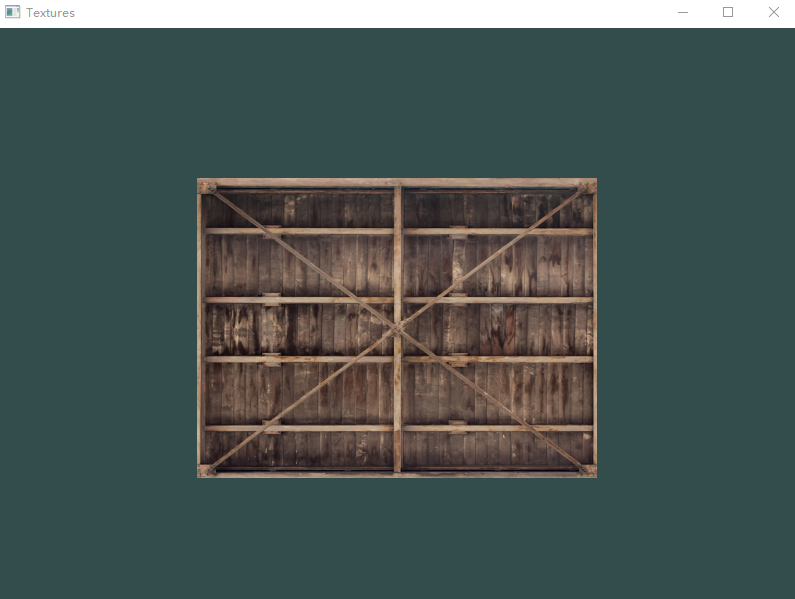
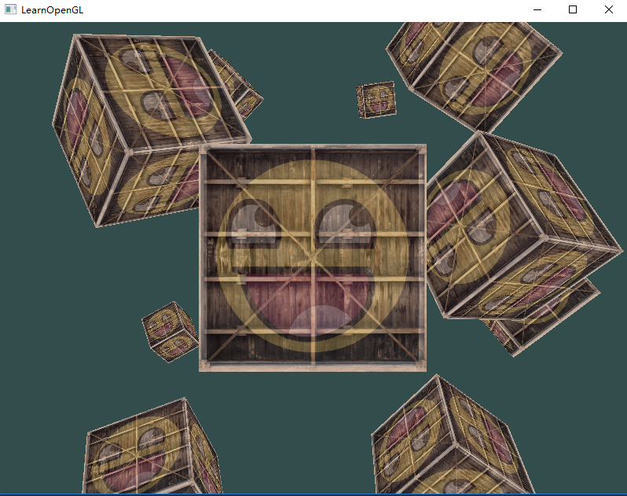

# LearnOpenGL

codes and notes in learning OpenGL

## Preface

I learned OpenGL on [https://learnopengl-cn.github.io/], this repo is used to record my leaning notes and codes.

## Notes

### 1

OpenGL3x以后，一般是核心模式，不要再用立即渲染模式了，显卡公司可针对OpenGL写扩展，如果该扩展非常流行，最终可以加在OpenGL主流更新里。

OpenGL是个状态机，OpenGL的状态通常叫做OpenGL上下文，我们最终使用当前上下文渲染。理解状态机有利于理解OpenGL。

OpenGL内核是个c库。

### 2

VAO:顶点数组对象;VBO:顶点缓冲对象;EBO:索引缓冲对象

OpenGL着色器语言：glsl
**
顶点着色器会在GPU上创建内存，也就是显存用来存储顶点数据；VBO用来管理这块显存，它可以一次性向这块显存存储大量顶点，以保证着色器可以立即访问到顶点，加快计算速度。**

### 3

着色器是一种非常独立的程序，它们之间不能相互通信，唯一的沟通方式只有通过输入和输出。

着色器的输入变量叫顶点属性，OpenGL确保至少有16个包含4分量的顶点属性可用。

layout，为了定义顶点数据该如何管理，使用location这一元数据指定输入变量，这样可以在CPU上配置顶点属性,（意思就是在程序里可以直接配置顶点属性）

uniform表示着色器程序中的全局变量，可以被任意着色器在任意阶段访问。如果声明一个uniform却在glsl代码中没用过，编译器会默认移除这个变量，导致最后编译出的版本中并不会包含它，这可能会导致错误。

### 4

纹理分辨率是程序员必须考虑的问题。在OpenGL中，纹理过滤有两个选项：GL_NEAREST和GL_LINEAR。

多级渐远纹理，mipmap。

纹理混合要设定哪个采样器采样哪个纹理，uniform sampler2D texture1。

### 5

四元数和3D旋转之间的关系，glm库从0.9.9版本起，默认会将矩阵类型初始化为一个零矩阵。
将一个向量(1,0,0)位移(1,1,0)个单位,代码如下：

''' c++
glm::vec4 vec(1.0f, 0.0f, 0.0f, 1.0f);
glm::mat4 trans = glm::mat4(1.0f);
trans = glm::translate(trans, glm::vec3(1.0f, 1.0f, 0.0f));
vec = trans * vec;
'''

先逆时针旋转90°（绕着z轴）然后缩放0.5，代码如下：

''' c++
glm::mat4 trans;
trans = glm::rotate(trans, glm::radians(90.0f), glm::vec3(0.0, 0.0, 1.0));
trans = glm::scale(trans, glm::vec3(0.5, 0.5, 0.5));
'''

把矩阵传递给着色器，在vertex shader里定义:

'''
uniform mat4 transform;
'''

在程序里，要查询uniform变量的地址，然后用有Matrix4fv后缀的glUniform函数把矩阵数据发送给着色器，如下，

'''
unsigned int transformLoc = glGetUniformLocation(ourShader.ID, "transform");
glUniformMatrix4fv(transformLoc, 1, GL_FALSE, glm::value_ptr(trans));
'''

### 6

OpenGL希望在每次顶点着色器运行后，我们可见的所有顶点都为标准化设备坐标(Normalized Device Coordinate, NDC)。也就是说，每个顶点的x，y，z坐标都应该在-1.0到1.0之间，超出这个坐标范围的顶点都将不可见。

### 7

FPS风格摄像机类的实现。

## Codes

>vs2015,8.1

### HelloWindow

主要是学会了生成lib文件，学会了相关库的简单使用和配置，更加熟练了vs这款IDE的功能。在项目PBF中，tutorials.docx中就有对配置的详细描述。

### HelloTriangle

了解了MVP转换，渲染管线，顶点着色器和片段着色器的使用。对这部分更深入的理解是学过Games101以及看过《Unityshader精要》、《3D Math For Game》等课之后，相关笔记在[我的博客](https://keneyr.github.io/)。

重点是两个缓冲对象VBO、EBO，一个顶点数组对象VAO

### Shaders

学会了location uniform等修饰词的意义，整理了有关使用shader使用的思路，有关cpu和gpu之间的通信关系，希望对gpu的理解可以更进一步，有想法继续读《GPU Germ》等书。

### Textures

纹理这块儿，主要理解的是UV映射，插值，分辨率等，当然深入一点还有displacement，normalmap等，这些知识在Games101已经学过，并记在了[我的博客](https://keneyr.github.io/)

关于纹理采样中的采样这个含义，涉及到通信知识。可以从Games101课程中稍作学习。

不同的图像类型都统一加载过来，使用的库是，stb_image.h库。

### Transformation

矩阵变换基础差不多，但是对四元数理解不够，glm库又重新认识了一下。

### Coordinate System

这里涉及到 local space、world space、view space、clip space、screen space，在[我的博客](https://keneyr.github.io/)有详细的记载。

OpenGL是右手坐标系。

### Camera

为什么感觉理解起来有点困难。
